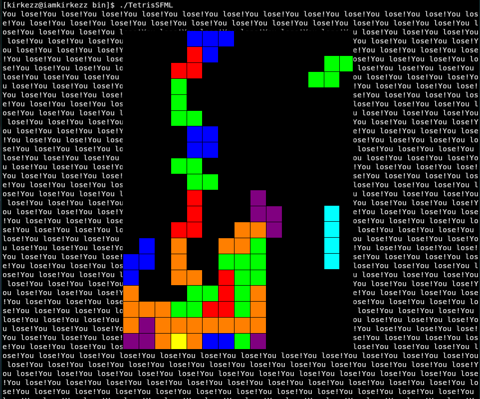

# Tetris

A simple implementation of the [Tetris](https://en.wikipedia.org/wiki/Tetris) game I wrote one day. Seems to contain a few bugs.



## build

The following should work:

```
cmake -S . -B build
cmake --build build --config Release
cd build/bin/
```
